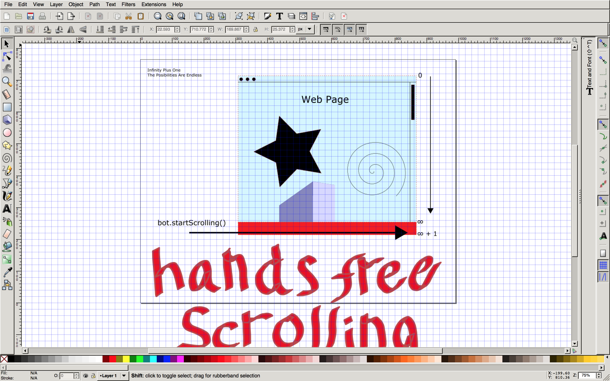

# Infinity Plus One
## The Posibilities Are Endless



Tired of touching your computer to scroll down on infinity scrolling webpages? Ever think to yourself, "THERE MUST BE A BETTER WAY"?

Now there is. Let's bots do the work for you. This bot scrolls. Hands free. Simple. Elegant. Beautiful.

The secret is in the code. Let's take a look.

```javascript
function startScrolling() {
  // if we can scroll some more, scroll to next, if we can't, try again.
  if ( position.height() !== 'undefined' || position.current() < position.height() ) {
    setTimeout(function() {
      position.scrollToNext();
      startScrolling();
    }, sleep_val);
  } else {
   setTimeout(function() {
    startScrolling
   }, sleep_val);
  } 
}
```

This bot knows how to scroll by scrolling. If it cannot scroll anymore, it tries to scroll again. Forever. 

## ))<>((
